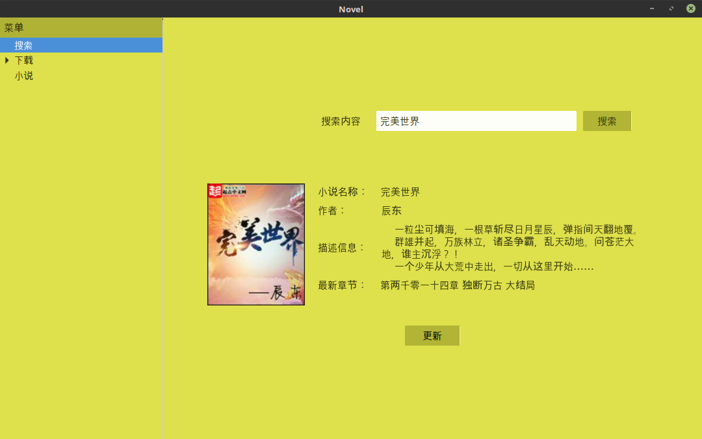
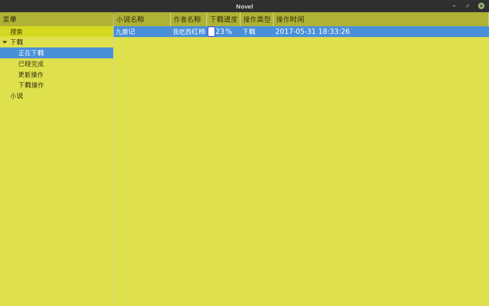
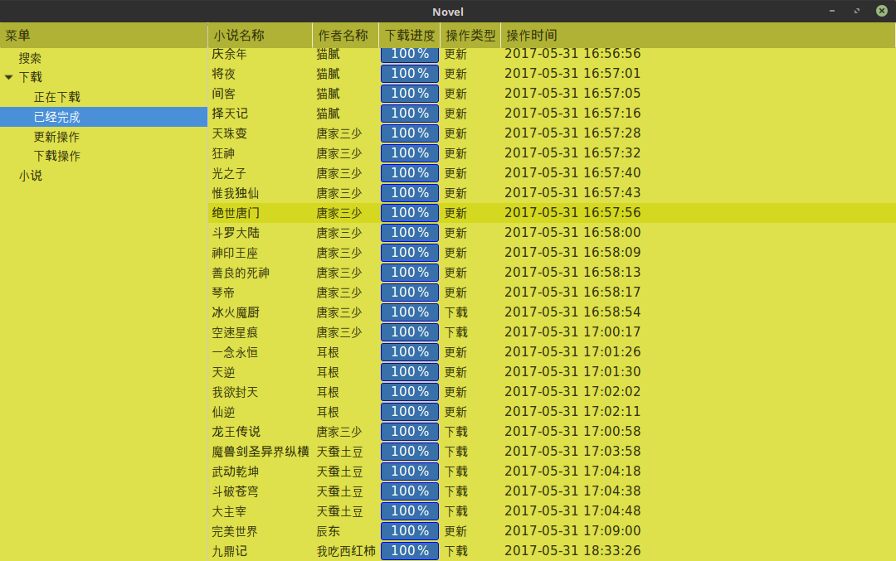
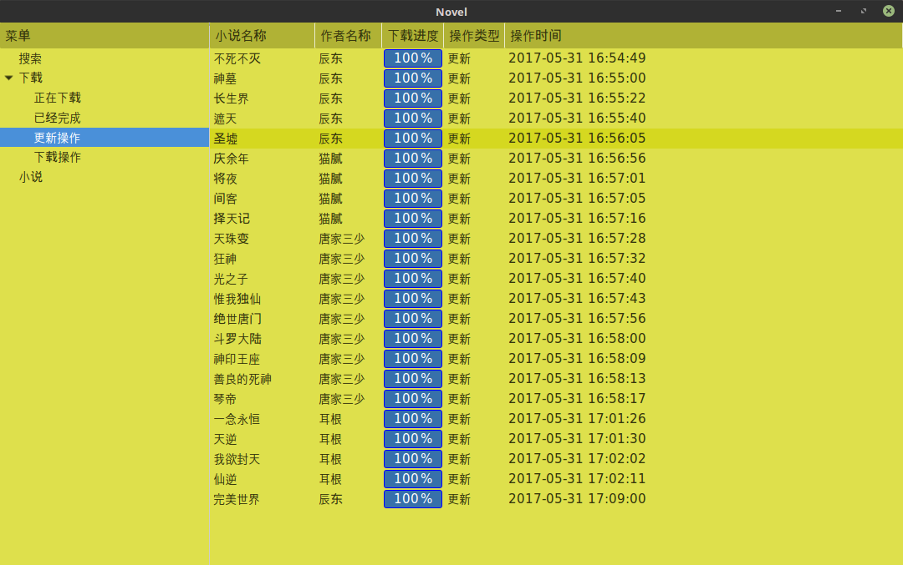
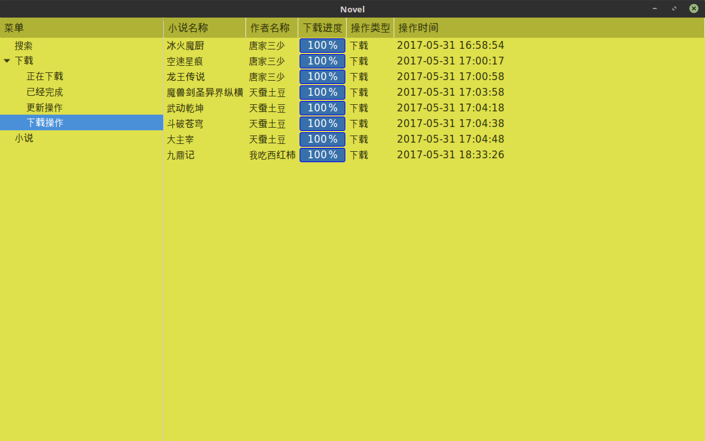
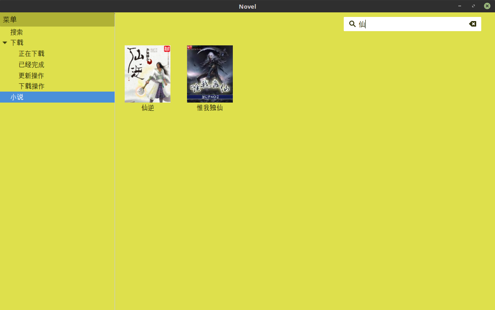
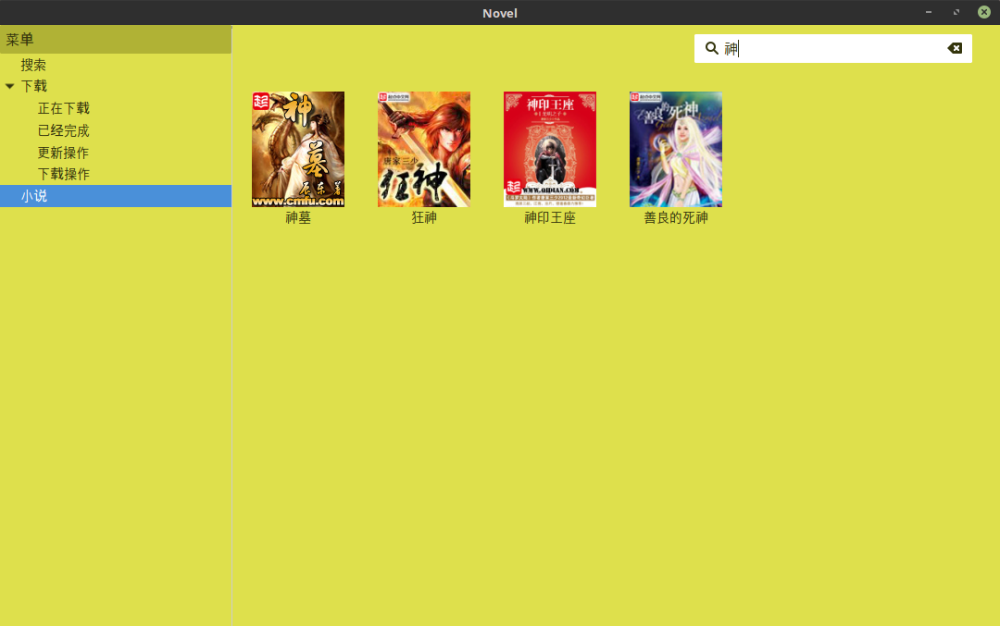
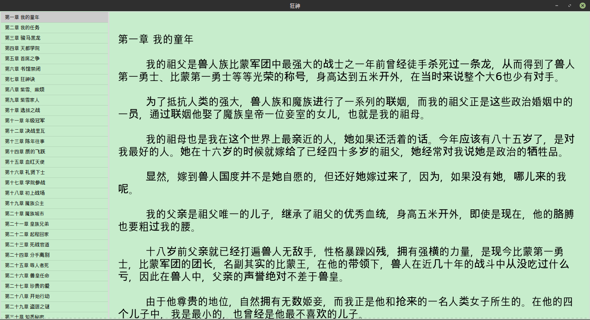

# novel

## 基本功能

novel集成了小说搜索，下载，更新，阅读为一体的应用程序。

内部使用golang开发后端，来从一些网站上抓取小说内容到本地上。使用pygobject来进行前端的ui开发。

这个软件因为采集了其他网站上的数据，所以只提供研究使用， 不能用于其他，并且因为擅自用于其他目的的后果，本项目概不负责。

## 运行效果

### 搜索功能

### 下载功能

### 显示本地所有小说功能

### 显示阅读小说功能

## 安装
在distrib目录中，有一个novel-linux-0.0.1.deb包， 当前只支持linux。 当你在gnome环境中（比如各种ubuntu或者linuxmint)执行
dpkg -i novel-linux-0.0.1.debg可能会提示缺少某些依赖，这个时候系统可能会提示你输入输入一些内容，你照着输入就行，然后再次安装就行了。
或者你直接使用gdebi来进行安装。实在不行，你可以讲缺少的依赖，给手动安装起来，然后就再次进行安装。 主要的依赖就是pygobject， 他实际上是gtk+
的一个python绑定。

## 软件技术架构简单说明

### 使用golang编写两个后端应用

#### search

他用来接口一个命令行参数，即你要搜索的小说名称，他会在后备源中进行搜索，并且将搜索到的内容通过命令行返回回来。 内部底层使用的是engine

#### backend

实现了小说下载和小说更新的功能， 底层也使用了engine (对应了整个源码中的engine包)

### 使用python3编写了两个前端应用

#### novel/app.py

用来提供小说搜索，下载， 更新， 列举所有功能。主要是通过命令行来和上面的search和bacend进行交互。

#### novel/view.py

用来提供小说阅读功能，并且会将你阅读过的小说的阅读章节和正文滚动条的位置给记录下来。 这个应用是通过novel/app.py的小说菜单中，双击某个小说图标，或者选中
小说，右击即可弹出菜单，选择阅读操作即可弹出。

### 在简单说一下engine包

他是整个后端的核心包，是整个应用的下载引擎。

他内部如下分层：

- Dao 用来保存内存中的小说到本地，或者从本地加载小说内容， 默认使用的是JsonDao， 你可以自己定义，比如你实现了数据库的Dao，就可以讲小说保存到数据库中
- Downloader 从网上下载内容,并且会将字符串自动转换为utf-8格式，这样golang就可以正确处理数据了, 内部默认的是net/http中的Get函数, 如果你要支持
其他协议你也可以自己写。
- Extracter 他是一个非常重要的东西，他可以从下载到来的数据中提取出真正的小说信息，比如小说标题，作者，描述，。。。， 当然还有小说章节，内容。我前面说的是类，
下载说的是extracter.go这个源文件中，内部有个全局变量用来管理Extracter，并且提供了RegisterExtracter函数，用来注册自定义的源提取器。就类似于golang
的数据库接口实现一样，对于某一种数据库，要注册自己的数据库驱动。这儿是对于不同的网站源，要注册自己的提取器
- Searcher 用来通过提取小说名称返回对应的小说页面所在的url。 他内部实际上和各个提取器所支持的网站是阳关的，具体看engine/searcher远吗，和extracter
中的实现。
- Engine 他是整个engine包的入口，他内部集成了上面提供的这些接口。并且上面Downloader, Extracter的默认都是无状态的，所以在下载和提取部分可以是线程
安全的。而Engine类的下载就是使用多个goroutine来进行下载的。具体你可以看一下源码。

这个包总的架构就是这样，还有一些细节比如：logging.go 就是辅助用来调试的， 他利用的是第三方库， 非常有意思，还可以配置输出颜色。还有个config.go 是一个
管理配置文件的类，准备以后配置文件信息都通过这个文件中的config对象来进行设置。

### 在说一下extracter目录

这个目录中有一个默认的提取器的， 用来提供从xxx笔网站上提取小说内容。 内部核心技术就是使用正则表达式来进行提取。可能后面的版本中，可能会开出一个新分之，来
使用xml path解析来进行提取，不支持是否能够获得性能提升（说实话， 我发现程序的瓶颈是各个小说源网站的网络状态，而不是提取速度， 所以使用path意义也不太大）。 

总而言之，就用到了正则表达式替换和查找自匹配两个操作

### novel/app.py novel/view.py

本项目两千多行代码，主要就是engine包和上面的两个文件。 因为上面两个源文件是使用python编写的，如果使用其他语言编写，可能还会更多。他主要利用的就是gtk+这个
库。 总之如果你想学习使用python来编写gtk+应用的话，那么推荐你先看一下http://python-gtk-3-tutorial.readthedocs.io/en/latest/index.html， 有
哪个类方法不太明白参考https://lazka.github.io/pgi-docs/， 直接搜索就行。嫌弃他比较慢的话，看一下devhelp, 没有灵感的话，在看一下gtk3-demo。

那个gtk3-totorial推荐看一下，因为里面设计到一些gtk+基本的概念，和编程技巧。发现gtk+还是一个非常牛逼的库，居然可以使用css样式来设置组件的基本样式。
上面两个应用用到的控件就是GtkLabel, GtkTreeView, GtkIconView， 你可以着重看一下， 因为使用了glade写的glade文件，你也要看一下glade章节，说实话，
以前没有接触过gtk+，没想到他真的非常牛。

## 总结

这个例子就是展示了如何使用golang来进行数据采集， 使用gtk+来进行数据展示， 如果大家有兴趣的话，可以勇于参加到这个项目中来， 开源世界在号召你们呢！

可以添加一些各个你们项提取网站的Extracter实现， 注意要在init函数中进行自注册

熟悉win32的朋友，可以将上面使用gtk+写的前端，使用win32来实现一下

不满足使用命令行接口来在前端和后端之间传递数据， 可以换成cs模式

思考，如果解决各个网站源网速不稳定问题， 如果预先建立小说缓存， 你是喜欢sqlite还是mysql, 所以你可以写你自己想写的Dao的实现了

。。。。

大家可以将各种想法分享出来，我们共同讨论， 并且付诸实现。
